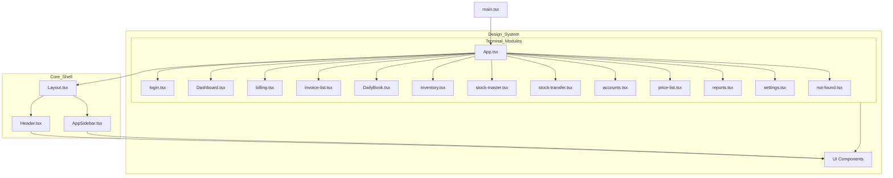

# KLKG Enterprise Resource System

A high-performance terminal interface designed for comprehensive kitchenware business management. This system provides a centralized operating environment for showroom operations, inventory logistics, and business intelligence.

## System Structure

The application is organized into specialized modules accessible via the central terminal:

- **Terminal Dashboard**: Centralized monitoring and key performance indicators.
- **Billing Interface**: High-speed invoice generation and price list access.
- **Invoice List**: Historical record and management of generated invoices.
- **Daily Book**: Secure financial closing and transaction logs.
- **Inventory Master**: Global stock tracking, categorization, and threshold alerts.
- **Stock Master**: Advanced multi-filter item management system.
- **Stock Transfer**: Logistics management between terminal showrooms.
- **Accounting**: Automated ledger management and financial reconciliation.
- **Price List**: Comprehensive pricing and margin management.
- **Reports**: Data-driven analytics and performance summaries.
- **Settings**: System configuration and terminal preferences.

## Codebase Architecture

The project follows a modular frontend-first architecture:




### Directory Mapping

- `client/src/pages/`: Contains all terminal modules (Dashboard, Billing, Inventory, Stock Master, Accounts, etc.).
- `client/src/components/layout/`: Core system frame including `Header.tsx`, `AppSidebar.tsx`, and `Layout.tsx`.
- `client/src/components/ui/`: Atomic Shadcn-based design components (buttons, dialogs, tables, etc.).
- `client/src/lib/`: Core utilities, including `mockData.ts` and `queryClient.ts`.

## Setup and Development

Follow these steps to run the environment locally:

1. **Install dependencies**:
   ```bash
   npm install
   ```

2. **Start the development server**:
   ```bash
   npm run dev:client
   ```

3. **Build for production**:
   ```bash
   npm run build
   ```

## Credits

Developed by ...GOD HIMSELF.
